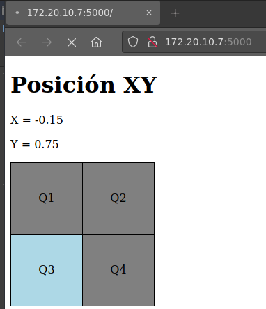

# Actividad Base: Flask + DataXY

Este repositorio es un ejemplo inicial para practicar con **Flask** y **GitHub**.
La intensión es que los estudiantes lo usen como punto de partida, lo modifiquen y luego lo suban a su propio repositorio.

---

## Objetivo

* Clonar el repositorio y trabajar en una copia personal
* Ejecutar Flask y recibir datos **x, y** desde una aplicación móvil
* Visualizar datos en una página HTML sencilla
* Subir cambios a GitHub

---

## Requisitos

* Entorno para Python y Flask instalados
* Cuenta en GitHub
* Aplicación móvil (APK) para enviar datos

---

## Descarga de Aplicación APK

Se puede descargar la aplicación móvil desde aquí:

[Descargar XYaTCPfull.apk](./XYaTCPfull.apk)

---

## Pasos básicos

### 1. Clonar el repositorio

```bash
git clone https://github.com/jotaefepece/Actividad-dataXY-base
cd Actividad-dataXY-base
```

### 2. Instalar y ejecutar la aplicación apk

```bash
### La red del celular tiene que estar en la misma red local ###
```

### 3. Ejecutar Flask

```bash
python3 app.py
```

### 4. Probar en el navegador

```
http://127.0.0.1:5000
```

---

## Estructura del ejercicio

```bash
.
├── app.py
├── capturas
│   ├── archivos-base.png
│   └── vista-base.png
├── README.md
├── templates
│   └── index.html
└── XYaTCPfull.apk
```

---

## Capturas

### Estructura de archivos


---

### Vista en el navegador



---

## Inicio del ejercicio

Cada estudiante debe:

* Crear una pestaña en Flask que muestre un dato recibido
* Modificar el HTML para encender una celda en un rectángulo **2x2** según los valores **x, y**
* Subir su versión modificada a su propio repositorio

---

## Notas

* Este README es solo una guía básica.
* El trabajo final depende de cada estudiante y de cómo adapte el ejercicio.

---
